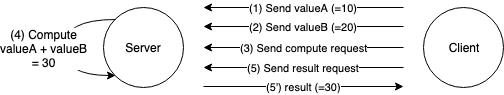
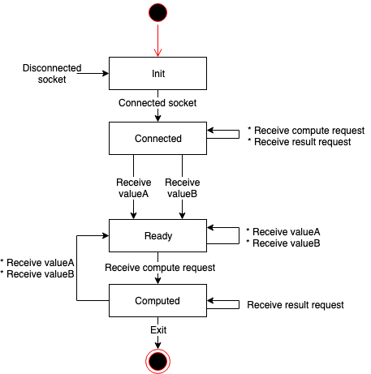

# StdSC

Standard Server Client Library

# Prerequisites
* CentOS 7.3
* Linux Kernel 3.10.0
* glibc 2.17
* g++ 4.8.5
* cmake >=2.8

# Building
Run following command to build the library.

```sh
$ mkdir build && cd build
$ cmake ..
$ make
```

* Generated files

| File | Content |
|:---|:---|
| stdsc/libstdsc.so | stdsc library |
| examples/add_server/client/demo_client | client of example app |
| examples/add_server/client/demo_server | server of example app |

# API Reference
* Run following command to build the documentation.
    ```sh
    $ cd doc && doxygen
    ```
* see `doc/html/index.html`

# Example
Example app (add server) consists of two processes: Server, Client. These processes communicate as shown in the following figure.



## Client
* Behavior
    * Client sends valueA (=10) to server. (Fig: (1))
    * Client sends valueB (=20) to server. (Fig: (2))
    * Client sends compute request to server. (Fig: (3))
    * Client sends result request to server, then receives the result (=30). (Fig: (5), (5'))
* Usage
    ```sh
    Usage ./client
    ```

## Server
* Behavior
    * Server receives valueA (=10) from client. (Fig: (1))
    * Server receives valueB (=20) from client. (Fig: (2))
    * Server receives compute request from client, then adds valueA and B. (Fig: (4))
    * Server receives result request from client, then return the result (=30). (Fig: (5), (5'))
* Usage
    ```sh
    Usage ./server
    ```
* State Transition Diagram

    
    
# License
Copyright 2018 Yamana Laboratory, Waseda University
Supported by JST CREST Grant Number JPMJCR1503, Japan.

Licensed under the Apache License, Version 2.0 (the "License");
you may not use this file except in compliance with the License.
You may obtain a copy of the License at

http://www.apache.org/licenses/LICENSE‐2.0

Unless required by applicable law or agreed to in writing, software
distributed under the License is distributed on an "AS IS" BASIS,
WITHOUT WARRANTIES OR CONDITIONS OF ANY KIND, either express or implied.
See the License for the specific language governing permissions and
limitations under the License.
